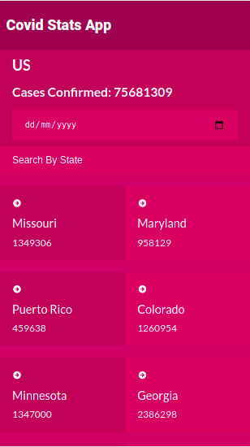
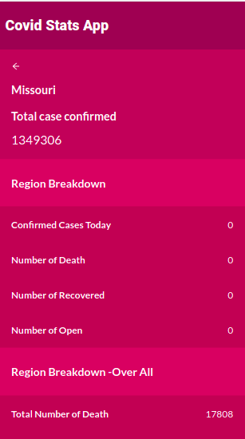
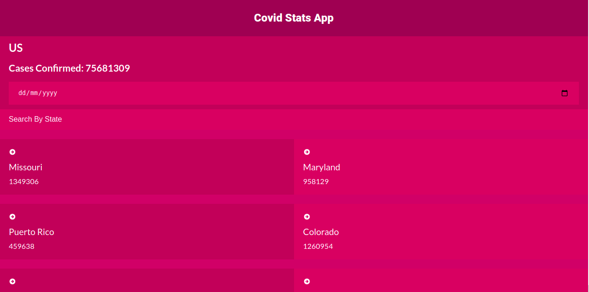

# Project Name
Covid Tracker Application





# Project Description

> The Covid-stats-app allows users to have access to the latest covid data in Us. They can also filter by region name, You can also get more informations on that specific region by clicking on it.
## Built With

- Major languages
    - JavaScript
    - HTML & CSS
- Frameworks
    - React
- State Management
    - Redux
- Text editor
    - VSCode
- Api
    - - [Narrativa API](https://covid19tracking.narrativa.com/index_en.html)

## Demo
- [live demo] (https://covid-app202.netlify.app)
## Getting Started


To get a local copy up and running follow these simple example steps.

### Prerequisites

- Have NodeJS installed
- Have Git Bash installed
- Have a code editor

### Setup

- Get this repository on your computer using ```git@github.com:Gbengacode/covid-app.git``` on any folder
- Open the created folder on your code editor

### Install

- Run ```npm install``` using your integrated console

### Usage

- You can launch the React app using ```npm start``` on your integrated console

## Author

👤 **Emmanuel Gbenga**

- GitHub: [@gbengacode](https://github.com/gbengacode)


## Acknowledgments

- This design inspired by
  [Nelson Sakwa](https://www.behance.net/sakwadesignstudio)

## 🤝 Contributing
Contributions, issues, and feature requests are welcome!

## Show your support

Give a ⭐️ if you like this project!

## 📝 License

This project is [MIT](./MIT.md) licensed.